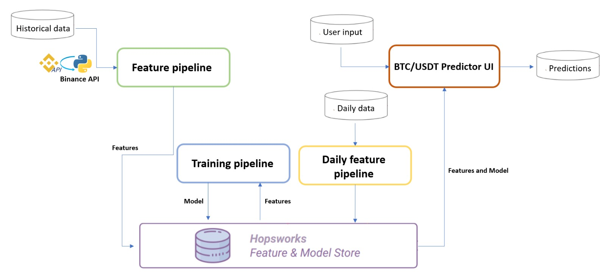

# BTC Price Prediction

### Problem description
The project seeks to address the challenging task of predicting daily Bitcoin prices through the development of an advanced machine learning system. 
In pursuit of this objective, the primary data source will be the Binance API, a comprehensive platform that supplies historical daily Bitcoin price data.
The central challenge at hand is the forecasting of future Bitcoin prices, a problem that inherently involves unraveling intricate patterns embedded within
the historical data and incorporating pertinent features.

Bitcoin, being a highly dynamic and volatile cryptocurrency, poses a complex prediction problem. 
The goal is to create a robust model capable of capturing the underlying trends, patterns, and 
dependencies in the historical price movements. By leveraging machine learning techniques,
specifically Multi Layer Perceptron and (MLP) and Long Short-Term Memory (LSTM) networks,
the project aims to provide a reliable tool for forecasting the future trajectory of Bitcoin prices.

### Tools

- Hopsworks : Feature store, model registry
- TensorFlow : Creating deep learning architectures.
- AWS  Serverless Lambda Function : Serverless functions for data ingestion.
- Docker : Containerization of lambda functions 
- EventBride : Event-Driven Function Invocation
- Google Colab : GPU access for model training
- Hugging Face Spaces : Interface Development

### Data

The primary data source is the Binance API, 
which provides historical Bitcoin price data. 
The dataset will include features such as open price,
high price, low price, close price, volume, and other relevant metrics. 
Data collection will involve periodic retrieval of daily price information through the Binance API.

### Methodology and Algorithm

In the pursuit of accurate and effective time series prediction for Bitcoin prices, 
a variety of models were explored, with notable success found in MLP 
(Multi-Layer Perceptron) and LSTM (Long Short-Term Memory) architectures. 
The proposed methodology centers around the application of LSTM, a 
specialized type of recurrent neural network (RNN), renowned for its 
proficiency in capturing long-term dependencies within sequential data. 
The LSTM model will be employed to analyze historical Bitcoin price data, 
leveraging its ability to discern intricate patterns and dependencies over extended temporal periods. 
Feature engineering will play a crucial role in enhancing the model's understanding of the underlying dynamics,
incorporating relevant metrics such as open price, high price, low price, close price, and volume. 
The hyperparameter tuning process is a pivotal step in optimizing the LSTM model's performance. 
A small subset of the dataset will be dedicated to this task, facilitating the fine-tuning 
of parameters such as the number of layers and nodes per layer.

### Structure of the Project

The project's structure is composed of four primary components: a feature pipeline, a training pipeline, a daily feature pipeline, and a user interface. The components are explained below.

The feature pipeline is responsible for data acquisition, utilizing the Binance API to retrieve data. Subsequent preprocessing tasks are performed on this data, ensuring that the features are suitably arranged before being stored in the feature store. 
In the training pipeline, the LSTM model is trained using the preprocessed features from the feature store. The model is registered for future use.
The daily feature pipeline functions to update the feature store with the most recent data. It takes the current day's price, applies the same preprocessing as done in the feature pipeline, and then stores this updated information in the feature store.
Lastly, the user interface plays a critical role. It captures user input regarding the desired prediction period, specifying how many days ahead the prediction should extend. Utilizing the up-to-date data from the feature store and the registered LSTM model, the system then generates and displays a graph representing the predicted prices for the specified period.

### User Interface

Our Bitcoin price prediction tool is designed to allow users to specify the number of days they wish to predict into the future via a user interface. When a user inputs a desired timeframe (in days), the tool generates a detailed graph. This graph integrates both the historical price data from the past 50 days and the predicted prices for the forthcoming days. In terms of performance, the model demonstrates commendable efficacy in short-term predictions. The user interface for this project can be accesable in [this link](https://huggingface.co/spaces/Kiwipirate/btc-predictor).